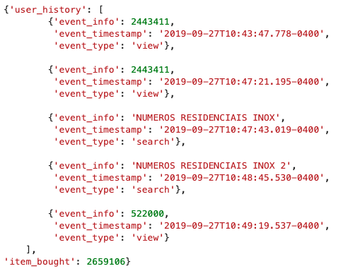
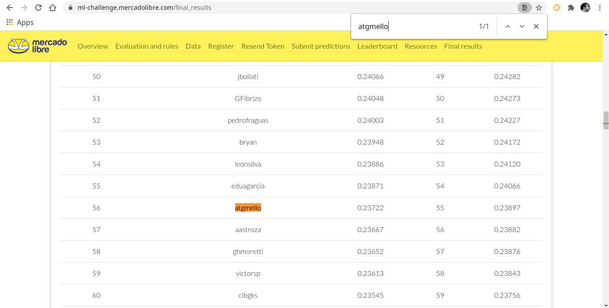

MercadoLibre Data Challenge 2020
==============================

This is a repository with my solution to MercadoLibre's 2020 
[Data Challange](https://ml-challenge.mercadolibre.com/).

# The challenge

> Build a Machine Learning model to predict next purchase based on the user’s navigation history.
>
> Mercado Libre hosts millions of product and service listings. Users navigate
> through them on countless occasions, looking for what they want to buy or just
> to get ideas on a new purchase.
>
> Understanding better what they might be interested in it’s critical to our
> business, so we can help them find what they’re looking for by providing
> customized recommendations based on the listings that are most suitable for
> each user's needs and preferences.
>
> Given a week of a user’s navigation records, we challenge you to predict (aka
> recommend) the ten most likely items of the next purchase.

# My take

The following is a somewhat high level description of my approach to solving
this problem. You can find more insights diving into the notebooks folders. I
tried my best to keep them as organized and as informative as possible.

## Feature engineering

The original datasets are essentially compressed jasonlines.
Each row is structure is as follows:



So in order to properly work with this data the first step I took was
to extract the most relevant information available from each user history
and work with it using [pandas](https://github.com/pandas-dev/pandas).

The main features extracted from each `user_history` list were
- The two most and the two last viewed items
- The two most and the two last searched terms/bi-grams

Getting the last/most viewed items is relatively straightforward.

Dealing with the "searched terms" portion of the dataset, on the other hand, was
a bit more work. I relied on some string manipulation and common preprocessing
techniques from NLP with the help of [nltk](https://github.com/nltk/nltk), such
as tokenization and stopword removal.

Next, I decided to focus on recovering the domains for each viewed item and
searched term.
A simple join to the items dataset was enough to get the domain each most/last
viewed item belonged to. 
The hard part was coming up with a way to find out the domain related to the
search terms.
This is certainly the most costly part of my approach.

First, each domain gets a "master title", built from the most common words
found in the item titles from each respective domain. Then, I make a vector out
of these "master titles" using a distilled RoBERTa multilingual pretrained model
from [UKPLab's
sentence-transformers](https://github.com/UKPLab/sentence-transformers).

Next, I transform the most/last searched terms/bi-grams using this same
embedder. Finally, I can determine which domain each term is closest to using
[PyNNDescent](https://github.com/lmcinnes/pynndescent) with the cosine metric.

After gathering the domain from all these different key items/searches, they are
used as features to estimate the bought item's domain. I use [sklearn's Random
Forest
classifier](https://scikit-learn.org/stable/modules/generated/sklearn.ensemble.RandomForestClassifier.html)
for this task.

In the end I have up to 8 different domains extracted from the original dataset
for each `user_history` plus a predicted domain, via Random Forest.
After some experimentation, the best approach to decide which is the one domain
most likely to be the bought item's domain for each `user_history` is to employ
a simple voting rule.

Say we have the following scenario for a given `user_history`: 
- the last viewed item's domain is `MLB_CELLPHONES`
- the most viewed item's domain is `MLM_NOTEBOOKS`
- the last searched term's domain is `MLM_GRAPHICS-CARD`
- the the Random Forest predicted domain is `MLB_CELLPHONES`.

In this case, we pick `MLB_CELLPHONES` as this user's "final" domain.

And wrapping things off, the recommendations.

An heuristic similar to the ones proposed during the [challenge's workshop](https://ml-challenge.mercadolibre.com/workshop) is used.
The 10 items recommendation list for a given user is filled with the item ids
from their last and most viewed items (which amount to 4) and the next 6
available slots are filled with the most bought items from the user's "final"
domain. Still using the example above, that user would receive as part of their
recommendation list the top 6 most bought cellphones.

Results
------------

My strategy achieved a NDCG score of 0.23722, leaving me at the 55th position in
the public ranking.



Usage
------------

I wanted to make sure this project would be reasonably reproducible. That's why
I went with the
[Cookiecutter Data Science](https://drivendata.github.io/cookiecutter-data-science)
project structure.

Once inside the project's root folder, all you have to do to reproduce my
results is

``` sh
make data
make predict
```

These commands take care of:
- setting up the python environment necessary to run this project
- executing all the necessary data manipulation and feature engineering
- generating the predictions for the given test dataset

Most of the heavy lifting is carried out during the feature engineering phase.
This part should take the longest. The prediction is based on fairly lightweight
heuristics and should be finished in no time once all the features are
available.

Environment
------------
This project was develop on a Linux environment using Python version 3.8.0.

A computer with at least 16 GB of RAM is recommend.

Project Organization
------------

    ├── LICENSE
    ├── Makefile           <- Makefile with commands like `make data` or `make train`
    ├── README.md          <- The top-level README for developers using this project.
    ├── data
    │   ├── external       <- Data from third party sources.
    │   ├── interim        <- Intermediate data that has been transformed.
    │   ├── processed      <- The final, canonical data sets for modeling.
    │   └── raw            <- The original, immutable data dump.
    │
    ├── docs               <- A default Sphinx project; see sphinx-doc.org for details
    │
    ├── models             <- Trained and serialized models, model predictions, or model summaries
    │
    ├── notebooks          <- Jupyter notebooks. Naming convention is a number (for ordering),
    │                         the creator's initials, and a short `-` delimited description, e.g.
    │                         `1.0-jqp-initial-data-exploration`.
    │
    ├── references         <- Data dictionaries, manuals, and all other explanatory materials.
    │
    ├── reports            <- Generated analysis as HTML, PDF, LaTeX, etc.
    │   └── figures        <- Generated graphics and figures to be used in reporting
    │
    ├── requirements.txt   <- The requirements file for reproducing the analysis environment, e.g.
    │                         generated with `pip freeze > requirements.txt`
    │
    ├── setup.py           <- makes project pip installable (pip install -e .) so src can be imported
    ├── src                <- Source code for use in this project.
    │   ├── __init__.py    <- Makes src a Python module
    │   │
    │   ├── data           <- Scripts to download or generate data
    │   │   └── make_dataset.py
    │   │
    │   ├── features       <- Scripts to turn raw data into features for modeling
    │   │   └── build_features.py
    │   │
    │   ├── models         <- Scripts to train models and then use trained models to make
    │   │   │                 predictions
    │   │   ├── predict_model.py
    │   │   └── train_model.py
    │   │
    │   └── visualization  <- Scripts to create exploratory and results oriented visualizations
    │       └── visualize.py
    │
    └── tox.ini            <- tox file with settings for running tox; see tox.readthedocs.io


--------

<p><small>Project based on the <a target="_blank" href="https://drivendata.github.io/cookiecutter-data-science/">cookiecutter data science project template</a>. #cookiecutterdatascience</small></p>
